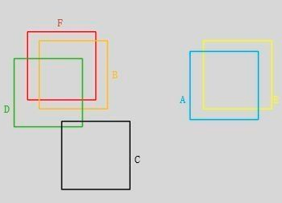
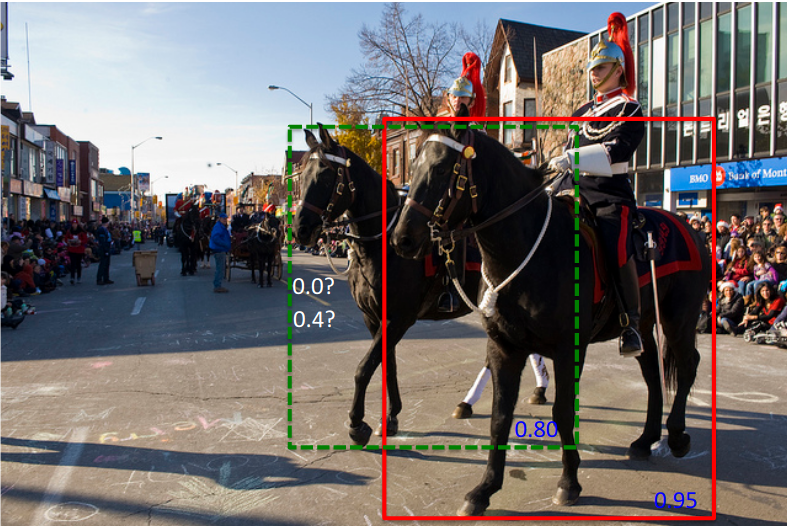
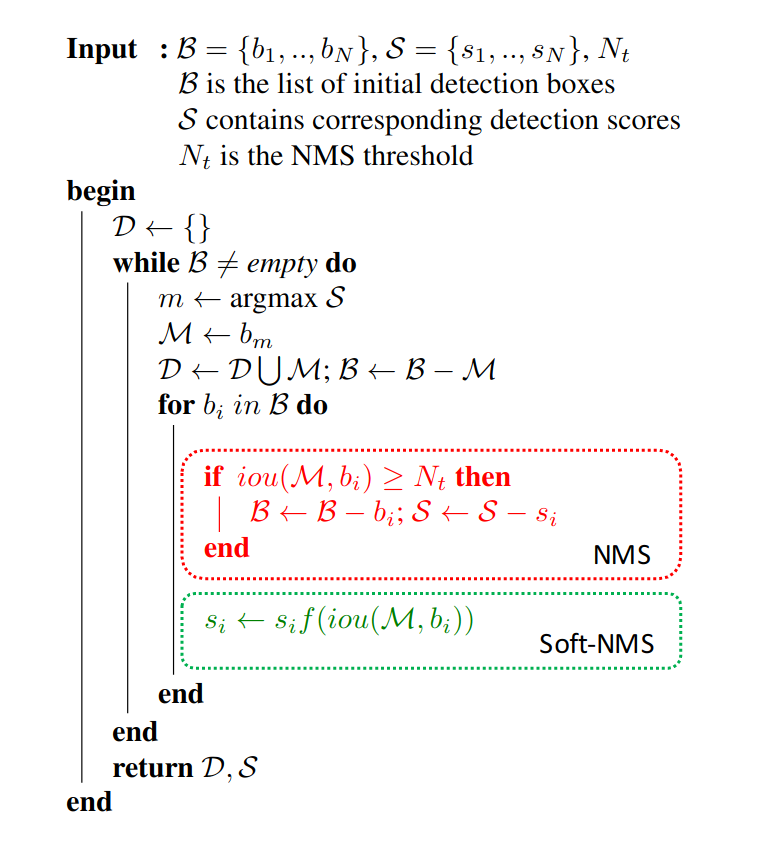

# Soft NMS

上图中bounding box的置信度大小的从小到大的排序为：A, B, C, D, E, F

## NMS

1. 选择置信度最大的box开始，计算该box和其它所有剩余box的iou;
2. 大于iou阈值的box的置信度设为0，小于iou阈值box的置信度不做改变;
3. 将置信度最大的box append到集合Set中;
4. 重复步骤1-3，直到Set的length等于6;
5. 选择一个置信度阈值，Set中大于该阈值的box当做最终的预测box

首先，从F开始，由于B，D和F的iou值大于阈值，将B， D的置信度设为0，；接着从E开始，由于A和E的iou大于阈值，因此将A的置信度设为0；接着再从C开始（因为D的置信度已经被设为0了），保留C。

NMS无法很好地区分稠密目标：

绿色框和红色框的iou较大，如果iou阈值设得过小，那么NMS会删除绿色框；如果设得过大，那么会有很多冗余的box被保留下来。

## Soft NMS

1. 选择置信度最大的box开始，计算该box和其它所有剩余box的iou;
2. 大于iou阈值的box的置信度设为 $s_i\cdot (1 - iou)$ 或者 $s_i\cdot e^-{\frac{iou^2}{\sigma}}$，小于iou阈值box的置信度不做改变;
3. 将置信度最大的box append到集合Set中;
4. 重复步骤1-3，直到Set的length等于6;
5. 选择一个置信度阈值，Set中大于该阈值的box当做最终的预测box

## 总结

