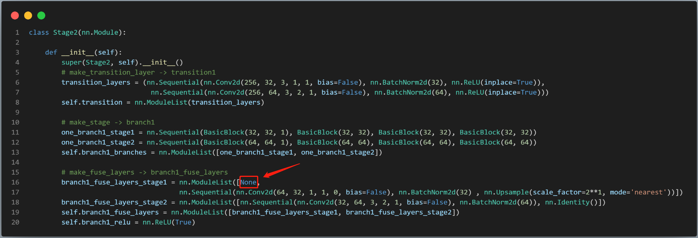
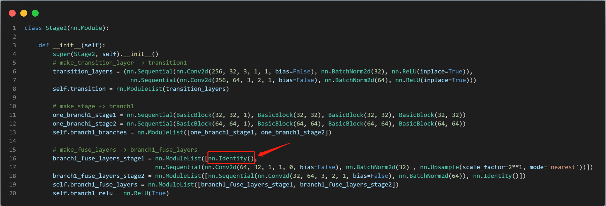

# libtorch

---
## 生成PT文件
在生成HRNet的pt文件，按照原始代码对模型代码进行简化后，按照如下代码进行生成：

```python
model = model.cpu()
model.eval()
pt = torch.jit.trace(model, dummy_tensor)
# pt = torch.jit.script(model, dummy_tensor)
torch.jit.save(pt, f"model_every_from_p5000_epoch100.pt")
```

过程中会报：

```shell
After commentting out this line(/anaconda3/envs/hrnet_env/lib/python3.6/site-packages/torch/jit/init.py", line 2195: assert(isinstance(orig, torch.nn.Module)))，this happend:
File "/anaconda3/envs/hrnet_env/lib/python3.6/site-packages/torch/jit/init.py", line 787, in make_module
return _module_class(mod, _compilation_unit=_compilation_unit)
File "/anaconda3/envs/hrnet_env/lib/python3.6/site-packages/torch/jit/init.py", line 2216, in init
tmp_module.training = orig.training
AttributeError: 'NoneType' object has no attribute 'training'
```
究其原因，是因为HRNet里面有这样的语句：


---

在进行libtorch进行序列化时，由于```None```不是pytorch中定义的layer，因此无法转换成功。由于```None```在这里是不起发挥任何作用，因此，可以使用```nn.Identity()```代替即可：



[可参考该链接](https://github.com/microsoft/nni/issues/2922)

---
## load PT模型

```c++
torch::jit::script::Module model = torch::jit::load(ptFilePath);  //pytorch model 
using torch::jit::script::Module;
std::shared_ptr<torch::jit::script::Module> model_ptr = std::make_shared<torch::jit::script::Module>(model);  // 将模型转换为智能指针
```

---
## 创建Tensor

### 从C++基础类型创建

```c++
// 从二进制文件中读取数据
std::shared_ptr<float> inputdata(new float[5 * 14 * 256 * 256](), std::default_delete<float[]>());
FILE* pFile = fopen(filepath.data(), "rb");
fread((char*)inputdata.get(), sizeof(float), 5 * 14 * 256 * 256, pFile);
fclose(pFile);
// 将指针读取数据病转换为Tensor数据类型
torch::Tensor voxel = torch::from_blob(inputdata.get(), {1, 5*14*256*256 }, dtype(torch::kFloat32));  // (batchsize, c, h, w)
```

### ```cv::Mat```到Tensor

注意：转换之前确保Tensor已经在CPU上，因为opecv不支持GPU的操作。

```c++
//大体思路：img->mat->tensor
cv::Mat image = cv::imread("gt_4.jpg");
torch::Tensor ten_img = torch::from_blob(image.data, {1, image.rows, image.cols, 3}, torch::kByte).to(device);
ten_img = ten_img.permute({0, 3, 1, 2});
ten_img = ten_img.toType(torch::kFloat);
ten_img = ten_img.div(255);
int h = ten_img.sizes()[2], w = ten_img.sizes()[3];
```


---

## Tensor到常用数据类型

```torch::Tensor```转float数组：

```c++
/**
 x 的类型为 CPUFloatType { 100, 100 } 
 x_data.size(0) = 100
 x_data.size(1) = 100
**/

/* 
 x_data.data() 是数据首地址 
*/
float array[100][100];
memcpy(array, x_data.data(), 100*100*sizeof(float));
```

```c++
torch::Tensor output = model.forward(input).toTensor();  // output的shape为(n, c, h, w),device为GPU
// 1. 先将output的device转换为CPU;
// 3. 将output resize成一维；
// 2. 再将output的类型转换为float数组;
float* out = output.to(at::kCPU).resize_({n*c*h*w}).data<float>();
```


---

## 访问Tensor

### 访问切片

```Tensor.slice```：返回的是浅拷贝。

```c++
// 使用torch::zeros创建Tensor
torch::Tensor module_arr = torch::zeros({ 5 * 256, 14 * 256 }).toType(torch::kFloat32);
for (size_t i = 0; i < 5*256; i++)
{
    // 使用slice方法获取Tensor切片
    module_arr.slice(0, i, i + 1) = voxel.slice(1, (i * 14 * 256), ((i + 1) * 14 * 256)).squeeze_().contiguous();
}
```

### 访问单个元素

```c++
torch::Tensor tmp = torch::ones({3,3});
int t = tmp[0][0].item<int>();
```

---

## Tensor数据类型转换

```c++
torch::Tensor x = torch::zeros({h, w, c}).toType(torch::kFloat32);
```

### ```cv::Mat```和Tensor类型数据互相转换

注意：转换之前确保Tensor已经在CPU上，因为opecv不支持GPU的操作。

```c++
//大致流程：tensor -> mat -> .jpg

//ten_wrp为tensor数据，squeeze()只用于batchsize为1的场景，permute 是将存储格式从pytorch形式转成opencv格式
ten_wrp = ten_wrp.to(torch::kCPU).squeeze().detach().permute({1, 2, 0});
//在处理前对cvmat中的值做了归一化，所以现在要*255恢复，同时对于不在0-255范围内的数据，需要做限制；cvmat的数据格式是8UC3，所以torch tensor要提前转换成kU8
ten_wrp = ten_wrp.mul(255).clamp(0, 255).to(torch::kU8);
//h, w为img的高和宽
cv::Mat resultImg(h, w, CV_8UC3);
//将ten_wrp数据存为resultImg格式
std::memcpy((void *) resultImg.data, ten_wrp.data_ptr(), sizeof(torch::kU8) * ten_wrp.numel());
//保存为result.jpg
cv::imwrite("result.jpg",resultImg);
```


---

## 不记录梯度信息

如果在一个语句中使用```torch::NoGradGuard no_grad;```，那么该语句中的所有tensor将不记录梯度信息：

```c++
auto x = torch::tensor({ 1. }, torch::requires_grad());
std::cout << x.requires_grad() << std::endl;  // prints true

{
    torch::NoGradGuard no_grad;
    auto y = x * 2;
    std::cout << y.requires_grad() << std::endl; // prints `false`
}

{
    auto doubler = [](torch::Tensor x) 
    {
        torch::NoGradGuard no_grad;
        return x * 2;
	};
    auto z = doubler(x);
    std::cout << z.requires_grad() << std::endl; // prints `false`
}
```
## CPU与GPU之间的转换

```c++
torch::NoGradGuard no_grad;
torch::Tensor tmp = torch::ones({2, 3});
if (torch::cuda::is_available())
{
    auto device = torch::Device(torch::kCUDA, 0);
}
tmp = tmp.to(device);  // tmp = tmp.to(other_tensor.device());
```
