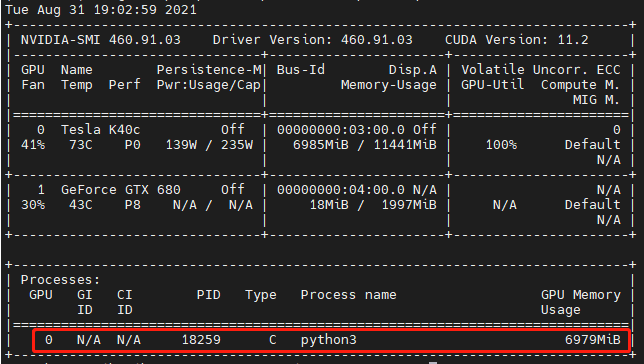
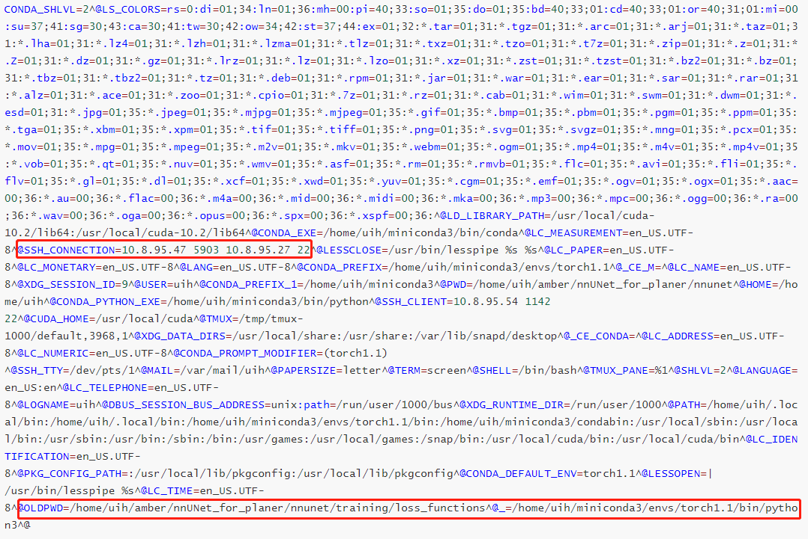

1. 首先使用nvidia-smi查看使用GPU进程的ID：

   

从上图可见是一个进程号为18259的python进程在使用GPU。下面查看是哪个用户使用哪个脚本运行的程序。

2. 使用ps命令查看运行该python进程所使用的命令

   ```shell
   $ ps aux | grep 18259
   uih       3428  0.0  0.0  16188   988 pts/4    S+   19:10   0:00 grep --color=auto 18259
   uih      18259 98.9  3.9 55197092 974480 pts/5 Rl+  Aug30 1527:34 python3 run/run_training.py 3d_fullres nnUNetTrainerV2_Loss_DiceTopK10 Task088_PETAILesionScout 0
   ```

可见，该python进程是使用**```python3 run/run_training.py 3d_fullres nnUNetTrainerV2_Loss_DiceTopK10 Task088_PETAILesionScout 0```**这条命令运行的。

接下来，我们查看是哪个用户运行的这条命令：

3. 使用如下命令，看进程文件里的environ，它里面记录了很多环境信息

   ```shell
   sudo vim /proc/18259/environ
   ```

   

该程序是10.8.95.47通过ssh连接到这台机器运行的程序，该程序位于**/home/uih/amber/nnUNet_for_planer/nnunet/training/loss_functions**文件夹下。

