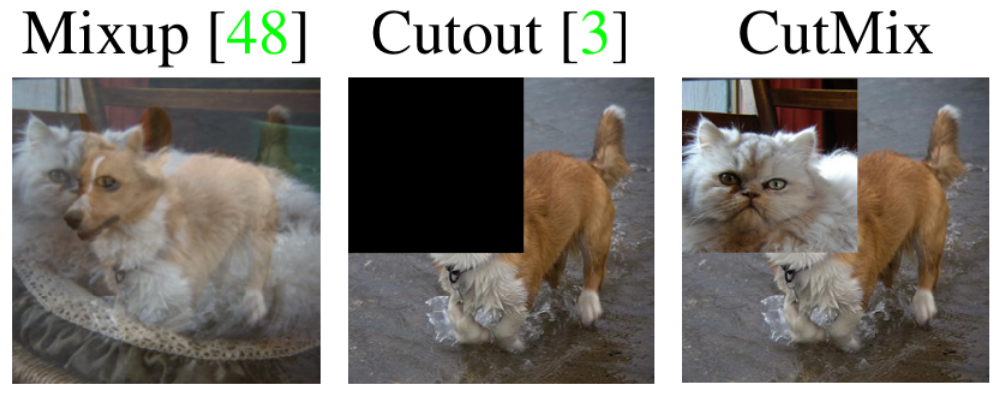
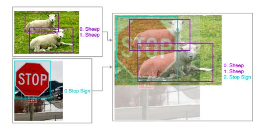
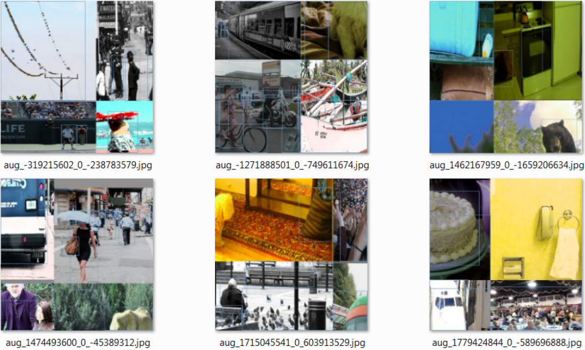

## backbone

总体而言，网络越深越好。

Yolov4指出，在分类任务上表现好的backbone不一定在目标检测任务上表现也好。

---

## normalization

1. BatchNorm: 对batchsize的大小敏感（一般不少于16才能有提升，太大的batchsize也并不能得到进一步提升）
2. SynBatchNorm:解决单卡batchsize不足的问题
3. Cross Iteration BathNorm: 解决单卡batchsize不足的问题，利用相邻iter的样本的方式来提高统计参数的准确性

---

## activate function

1. Relu: $f(x) = max(0, x)$
2. leak Relu: $f(x) = max(ax, x)$
3. Relu6: 转为网络量化而设计
4. SELU: 难以训练
5. Parametric Relu: 难以训练
6. Swish: $f(x) = x\cdot sigmoid(\beta x)$
7. Mish: $f(x) = x \cdot tanh(\ln (1 + e^x))$

---

## regularization

1. dropout
2. dropblock
3. spatial dropout
4. droppath

---

## data augmentation

1. cutout
2. cutmix

3. mixup

图片的融合是很明确的逐像素相加，融合得到的新图的尺寸是取两张图片的中的最大值，也就是说(600,800)和(900,700)两张图融合得到的新图大小是(900,800)，新增的部分取零，这一步的意义是确保新图装得下原先的两张图，且不改变检测框的绝对位置；

4. mosaic

## skip connection

1. residual connection
2. weighted residual connection
3. cross stage partial connection

---

## input image size

高分辨率的训练图片更有利于：

1. 检测小目标；
2. 搭建更深的网络；
3. 增大感受野

---

## loss function

1. iou loss: GIOU, DIOU, CIOU

iou loss 的优势在于其具有尺度不变的特性。

2. mse

使用mse计算box四个变量（[xmin, ymin, xmax, ymax]或者[center_x, center_y, w, h]）时，相当于把这四个值当做独立的变量，而事实是他们其实是一个整体。这个角度来说iou loss更合理些（但是使用iou loss可能会照成网络无法收敛，或者训练很慢的情况）

---

## NMS

1. general NMS
2. soft NMS
3. DIoU NMS

---

## optimization shceduler

1. step scheduler
2. cosine annealing scheduler
3. ...