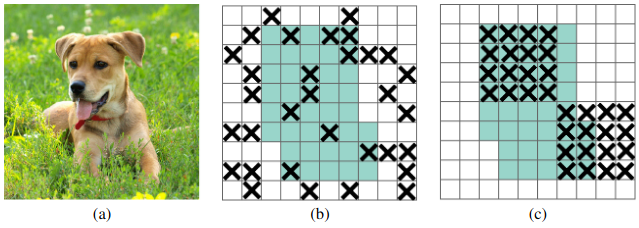
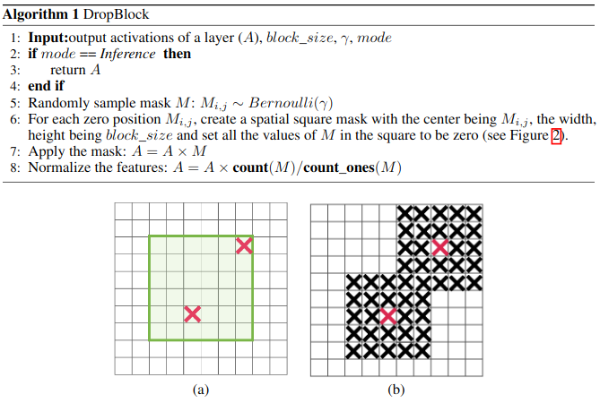

# DropBlock

dropout方法多是作用在全连接层上，在卷积层应用dropout方法意义不大。文章认为是因为每个feature map的位置都有一个感受野范围，仅仅对单个像素位置进行dropout并不能降低feature map学习的特征范围，也就是说网络仍可以通过该位置的相邻位置元素去学习对应的语义信息，也就不会促使网络去学习更加鲁邦的特征。既然单独的对每个位置进行dropout并不能提高网络的泛化能力，那么很自然的，如果我们按照一块一块的去dropout，就自然可以促使网络去学习更加鲁邦的特征。思路很简单，就是在feature map上去一块一块的找，进行归零操作，类似于dropout，叫做dropblock



色阴影区域是语义特征，b图是模拟dropout的做法，随机丢弃一些位置的特征，但是作者指出这中做法没啥用，因为网络还是可以推断出来，(c)是本文做法。dropblock有三个比较重要的参数，一个是block_size，用来控制进行归零的block大小；一个是$\lambda$，用来控制每个卷积结果中，到底有多少个channel要进行dropblock；最后一个是keep_prob，作用和dropout里的参数一样。



M大小和输出特征图大小一致，非0即1，为了保证训练和测试能量一致，需要和dropout一样，进行rescale。

上述是理论分析，在做实验时候发现，block_size控制为7*7效果最好，对于所有的feature map都一样，γ通过一个公式来控制，keep_prob则是一个线性衰减过程，从最初的1到设定的阈值(具体实现是dropout率从0增加到指定值为止)，论文通过实验表明这种方法效果最好。如果固定prob效果好像不好。实践中，并没有显式的设置  的值，而是根据keep_prob(具体实现是反的，是丢弃概率)来调整。


**DropBlock in ResNet-50 DropBlock加在哪？**

最佳的DropBlock配置是block_size=7，在group3和group4上都用。将DropBlock用在skip connection比直接用在卷积层后要好

---

## Pytorch实现

```python
class DropBlock2D(nn.Module):
    r"""Randomly zeroes 2D spatial blocks of the input tensor.

    As described in the paper
    `DropBlock: A regularization method for convolutional networks`_ ,
    dropping whole blocks of feature map allows to remove semantic
    information as compared to regular dropout.

    Args:
        drop_prob (float): probability of an element to be dropped.
        block_size (int): size of the block to drop

    Shape:
        - Input: `(N, C, H, W)`
        - Output: `(N, C, H, W)`

    .. _DropBlock: A regularization method for convolutional networks:
       https://arxiv.org/abs/1810.12890

    """

    def __init__(self, drop_prob, block_size):
        super(DropBlock2D, self).__init__()

        self.drop_prob = drop_prob
        self.block_size = block_size

    def forward(self, x):
        # shape: (bsize, channels, height, width)

        assert x.dim() == 4, \
            "Expected input with 4 dimensions (bsize, channels, height, width)"

        if not self.training or self.drop_prob == 0.:
            return x
        else:
            # get gamma value
            gamma = self._compute_gamma(x)

            # sample mask, 小于gamma对应的block会被丢弃
            mask = (torch.rand(x.shape[0], *x.shape[2:]) < gamma).float()

            # place mask on input device
            mask = mask.to(x.device)

            # compute block mask
            block_mask = self._compute_block_mask(mask)

            # apply block mask
            out = x * block_mask[:, None, :, :]

            # scale output
            out = out * block_mask.numel() / block_mask.sum()

            return out

    def _compute_block_mask(self, mask):
        # 比较巧妙的实现，用max pool来实现基于一点来得到全0区域
        block_mask = F.max_pool2d(input=mask[:, None, :, :],
                                  kernel_size=(self.block_size, self.block_size),
                                  stride=(1, 1),
                                  padding=self.block_size // 2)

        if self.block_size % 2 == 0:
            block_mask = block_mask[:, :, :-1, :-1]

        block_mask = 1 - block_mask.squeeze(1)

        return block_mask

    def _compute_gamma(self, x):
        return self.drop_prob / (self.block_size ** 2)
```

测试：

```python
>>> import torch
>>> import torch.nn.functional as F
>>> mask = torch.zeros(size=[1, 10, 10], dtype=torch.float32)
>>> mask[0, 2, 7] = 1
>>> mask[0, 6, 4] = 1
>>> mask
tensor([[[0., 0., 0., 0., 0., 0., 0., 0., 0., 0.],
         [0., 0., 0., 0., 0., 0., 0., 0., 0., 0.],
         [0., 0., 0., 0., 0., 0., 0., 1., 0., 0.],
         [0., 0., 0., 0., 0., 0., 0., 0., 0., 0.],
         [0., 0., 0., 0., 0., 0., 0., 0., 0., 0.],
         [0., 0., 0., 0., 0., 0., 0., 0., 0., 0.],
         [0., 0., 0., 0., 1., 0., 0., 0., 0., 0.],
         [0., 0., 0., 0., 0., 0., 0., 0., 0., 0.],
         [0., 0., 0., 0., 0., 0., 0., 0., 0., 0.],
         [0., 0., 0., 0., 0., 0., 0., 0., 0., 0.]]])
>>> block_mask = F.max_pool2d(mask, kernel_size=[5, 5], stride=[1, 1], padding = 1)
>>> block_mask
tensor([[[0., 0., 0., 0., 1., 1., 1., 1.],
         [0., 0., 0., 0., 1., 1., 1., 1.],
         [0., 0., 0., 0., 1., 1., 1., 1.],
         [0., 1., 1., 1., 1., 1., 1., 1.],
         [0., 1., 1., 1., 1., 1., 0., 0.],
         [0., 1., 1., 1., 1., 1., 0., 0.],
         [0., 1., 1., 1., 1., 1., 0., 0.],
         [0., 1., 1., 1., 1., 1., 0., 0.]]])
```

---

## Reference

作者：深度眸
链接：https://zhuanlan.zhihu.com/p/139764729
来源：知乎
著作权归作者所有。商业转载请联系作者获得授权，非商业转载请注明出处.
