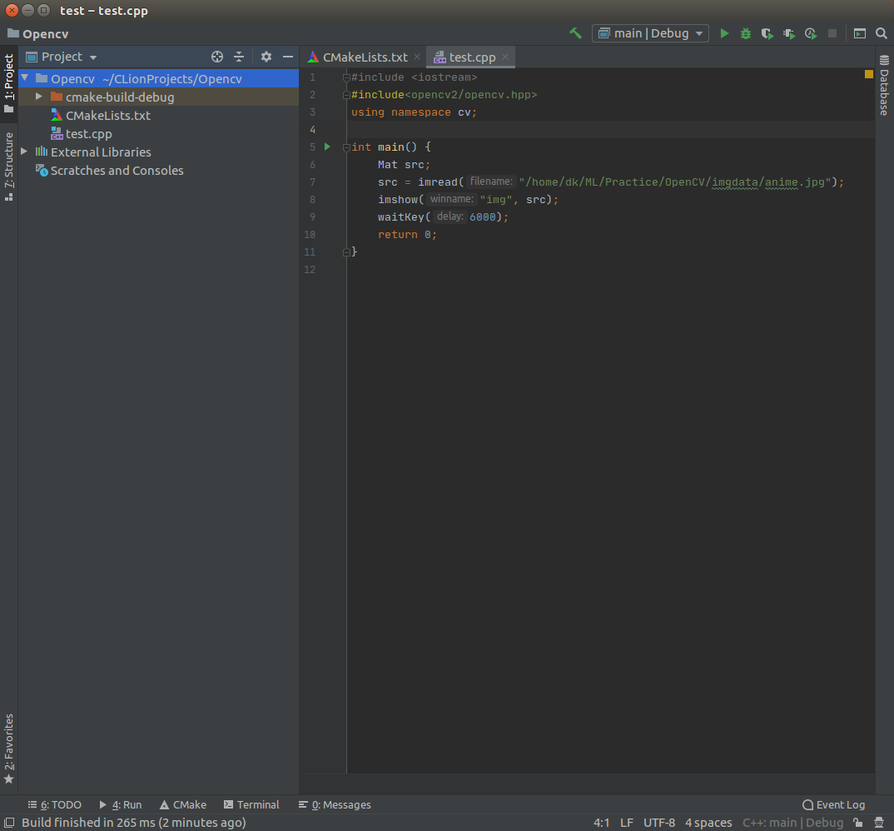

## 准备步骤

```bash
dk@dk:~$ sudo apt-get update
dk@dk:~$ sudo apt-get upgrade
dk@dk:~$ sudo apt-get install cmake
```

## 安装依赖包

```bash
dk@dk:~$ sudo apt-get install cmake libgtk2.0-dev pkg-config libavcodec-dev libavformat-dev libswscale-dev
dk@dk:~$ sudo apt-get install libtbb2 libtbb-dev libjpeg-dev libpng-dev libtiff5-dev libdc1394-22-dev # 处理图像所需的包
dk@dk:~$ sudo apt-get install libavcodec-dev libavformat-dev libswscale-dev libv4l-dev liblapacke-dev
dk@dk:~$ sudo apt-get install libxvidcore-dev libx264-dev # 处理视频所需的包
dk@dk:~$ sudo apt-get install libatlas-base-dev gfortran # 优化opencv功能
dk@dk:~$ sudo apt-get install ffmpeg
```

## 下载并解压opencv

下载opencv source code：https://github.com/opencv/opencv/archive/3.4.10.zip

```bash
cd ~
dk@dk:~$ mkdir Opencv
dk@dk:~$ cd Opencv
dk@dk:~/Opencv$ mv ~/Downloads/opencv-3.4.10.zip ./
dk@dk:~/Opencv$ cd opencv-3.4.10
dk@dk:~/Opencv/opencv-3.4.10$ mkdir build
dk@dk:~/Opencv/opencv-3.4.10$ cd build
dk@dk:~/Opencv/opencv-3.4.10/build$ cmake -D CMAKE_BUILD_TYPE=RELEASE -D CMAKE_INSTALL_PREFIX=/usr/local -D WITH_TBB=ON -D BUILD_NEW_PYTHON_SUPPORT=ON -D WITH_V4L=ON -D INSTALL_C_EXAMPLES=ON -D INSTALL_PYTHON_EXAMPLES=ON -D BUILD_EXAMPLES=ON -D WITH_QT=ON -D WITH_GTK=ON -D WITH_OPENGL=ON ..
```

```bash
dk@dk:~/Opencv/opencv-3.4.10/buildmake
```

如果`make`出错（有关anconda的错误），尝试：

```bash
dk@dk:~/Opencv/opencv-3.4.10/build$ conda uninstall libtiff
dk@dk:~/Opencv/opencv-3.4.10/build$ make
```

[reference](https://github.com/JdeRobot/DetectionStudio/issues/99)

```bash
dk@dk:~/Opencv/opencv-3.4.10/build$ make install
或者
dk@dk:~/Opencv/opencv-3.4.10/build$ sudo make install
```

## 配置OpenCV环境

进入/etc/profile配置文件，在文件末尾追加添加以下命令：

```bash
export  PKG_CONFIG_PATH=$PKG_CONFIG_PATH:/usr/local/lib/pkgconfig 
```

添加完之后使用命令行更新配置文件

```bash
source profile
```

查看版本号，验证是否安装成功

```bash
pkg-config --modversion opencv
```

## 测试




如果运行`test.cpp`出现如下错误：

```bash
The function is not implemented. Rebuild the library with Windows, GTK+ 2.x or Carbon support. If you are on Ubuntu or Debian, install libgtk2.0-dev and pkg-config, then re-run cmake or configure script in function cvNamedWindow
```

可尝试安装依赖包：

```bash
sudo apt-get install aptitude
sudo aptitude install libgtk2.0-dev
```

[reference](https://stackoverflow.com/questions/28776053/opencv-gtk2-x-error)

运行`test.cpp`文件，成功！

## 参考文献

[reference](https://www.cnblogs.com/chenguifeng/p/12639756.html)
